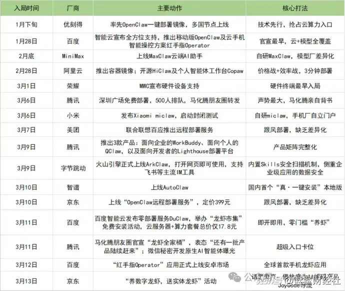
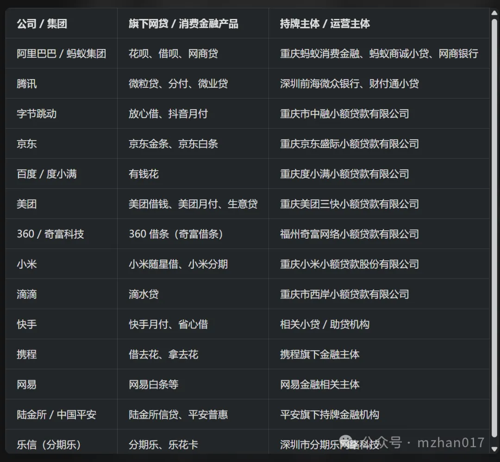

[[回到列表]](https://mzhan017.github.io/)
#  [AI] 疯狂背后的思考？
## 观察
<p>
这些天看到小龙虾的养殖比较火，然后根据观察，网络上流行着一张图（摘自https://www.thepaper.cn/newsDetail_forward_32761105）几乎所有中国前沿科技公司都疯狂了：
</p>



<p>
看到上面的图表，看着里面的公司列表这么眼熟来，我就想到了搞贷款的科技公司来了，就让豆包先生生成了一张表格，豆包问题：汇总中国高科技公司搞网贷的公司名称列表，如下：
</p>



<p>
这样看，这个重合率还是很高的。如果你要是支付宝的忠实用户，可能还会对比较经典的广告词记忆犹新：包括找零不再难！借呗给孩子过生日（这个还导致了中国人大思考，生日都过不起，那还.....）等等......
</p>
<p>
所以我想这个Openclaw到底有什么特别的，特意让豆包生成了Openclaw的实现架构。豆包问题：openclaw的核心代码是什么？根据下面的内容，我们会发现这些功能/架构/技术栈，实现起来并不难，只要有想法，耐着性子做，一定可以做出来。
</p>
<p>
所以这里存在一个关键的问题：为什么小龙虾偏偏是国外实现，然后被中国科技公司疯狂跟进？最后的问题是，中国科技公司有没有机会想出这么一个项目，并实现？难道是资不配位？<br>
</p>

# 下面是Openclaw的架构/代码：

## openclaw 核心代码

核心代码是一套基于TypeScript/Node.js实现的三层消息路由+智能体执行系统，核心是让聊天消息能安全转发并驱动本地AI执行任务。技术栈：TypeScript+Node.js+WebSocket(协议：MIT开源)。
核心逻辑全部在 src/下，按职责分为四大块：

```
openclaw/
└── src/
    ├── gateway/       # 网关核心：消息转发、会话、路由
    ├── channels/      # 聊天平台适配器（WhatsApp/Telegram/Discord等）
    ├── agents/        # AI智能体：Pi运行时、LLM交互、工具调用
    └── skills/        # 技能系统：工具注册、执行、沙箱
```

1. Gateway层（消息桥梁，最核心）：负责接收聊天消息、管理会话、路由到 AI，并返回结果。入口：src/gateway/server.ts。启动WebSocket服务，监听本地/网络连接；管理所有聊天客户端与AI智能体的连接池。
    核心：src/gateway/routing/message-router.ts

 ```
    class
    MessageRouter
    {
    // 注册消息处理器（如text、command、file）
    registerHandler(type, handler)
    // 路由消息：中间件→匹配处理器→执行
    async routeMessage(message, connection)
    // 管理WebSocket连接生命周期
    handleConnection(ws)
    }
```

    会话：src/gateway/session-manager.ts。维护用户上下文、对话历史、权限与状态

2. Channels 层（聊天平台适配），统一封装各 IM 平台的 API，提供标准化接口给 Gateway。目录：src/channels/，whatsapp/，telegram/、discord/、imessage/等。
    核心：每个平台实现统一的 Channel 接口

```
    interface
    Channel
    {
    sendMessage(chatId, text)
    onMessage(callback)
    // 监听新消息
    connect()
    disconnect()
    }
```

3. Agents 层（AI 执行核心）对接 Pi 等编程智能体，处理 LLM 调用、工具执行、沙箱安全。Pi 运行时：src/agents/pi-embedded-runner/。本地启动 Pi 智能体进程，执行read/write/bash 等命令。实现沙箱隔离（Cell Isolation），限制文件 / 命令权限
    LLM 交互：src/agents/model-resolver.ts
        统一调用 OpenAI/Claude/Gemini 等模型 API
    工具系统：src/agents/pi-tool-definition-adapter.ts
        注册并暴露文件读写、命令执行等工具给 AI

4. Skills 层（可扩展能力）
动态加载、执行用户 / 社区技能，是 OpenClaw 可扩展的基础。目录：src/skills/
    loader.ts：加载本地 / 远程技能包
    registry.ts：技能注册表
    executor.ts：在沙箱中执行技能代码

### 核心启动流程（一句话）
    启动 gateway/server.ts → 开启 WebSocket 服务
    加载 channels/ 下的 IM 适配器 → 连接 WhatsApp/Telegram 等
    启动 agents/pi-embedded-runner → 本地运行 Pi 智能体
    消息流转：IM→Channel→Gateway Router→Pi Agent→ 执行命令 → 结果返回 IM
