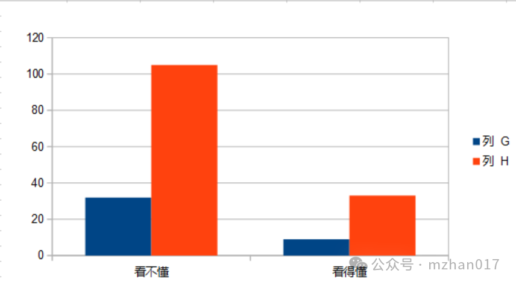

[[English]](../chat/2026-3-15.md)|[[回到列表]](https://mzhan017.github.io/)
# [杂谈] 信息滞后的必然性？
## 总结参考
前些天写了一个：《这玩意都能开源？》是一个开源的战情总结内容网站。看了一下，写的还行。
然后根据文章下的参考，比如一篇总结参考了一百多篇的网络内容:https://understandingwar.org/research/middle-east/iran-update-february-26-2026/。 
我就想看看有哪些参考我能看（如果我能自己看，其实信息的获取会快一点，更早一步，或许可以拿个三手四手的消息？），并且可以看得懂。但结果数据是触目惊心，
## 数据如下：
G列是网站数量；H列是文章内容参考数量。因为有些网站里的内容被参考多篇，所以红色比蓝色多。这里可以看可访问的英文网站相对只有20%。这个数据还是触目惊心的，默认其他人就是比自己多百分之八十的信息量，这怎么比？

## 结论
在《美国以色列伊朗战争趋势》，这篇下面还有人质疑说你这个信息太落后了，是的，落后/滞后是有原因的。
根据这个数据来看，信息滞后是必然的结果。这个信息获取就不能及时了。