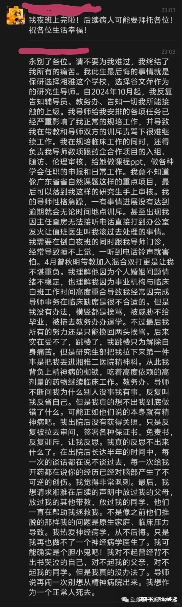

[[回到列表]](https://mzhan017.github.io/)
# [杂谈] 不公是常态？又一名学生选择自杀！
## 不公平
最近看到一个问题，以及下面的一个答案，感觉很有趣，大概意思是说：要认识世界的不公，才能增加自己的承压能力。（https://www.zhihu.com/question/1916743585799308145/answer/1916833693017834600） 
其实这种说法也不能说完全错，因为如果这种不公的压力都承受不住，怎么才能有能力反抗不公的现状？但是仍然需要说明的一点就是，我们努力奋斗的目标，是为了让不公的社会变得更公平，而不是极力来承认不公的存在，并承受之。
## 新闻事件
又看到一个现实的例子：（https://zhuanlan.zhihu.com/p/2016998007510414599） 一位研究生迫于压力自杀。这种事情每隔一段时间就出来一个，每隔一段时间就出来一个，每隔一段时间就出来一个。（就像315晚会，大家难道不奇怪为什么每年315晚会都能有节目？）难道大家不反思，并努力改正的吗？社会的管理者们在干什么？里面有一封遗书，其实一篇遗书可以道尽这世界的很多不公平场景。又包括讨要公道而无门，自己又处于弱势的场景，能怎么办？

## 感想
[其实英语并不好学——江苏小朋友自杀有感！](https://mp.weixin.qq.com/s?__biz=MzkzMDIwMDkzNQ==&mid=2247487341&idx=2&sn=a5c61e356e6cd407c210c213320077b7&scene=21&poc_token=HHtbuWmjprmqiE0C8v4_RY91nQojmWT-h-jONTNG) 
[顺从的表象之一受冤自杀](https://mp.weixin.qq.com/s?__biz=MzkzMDIwMDkzNQ==&mid=2247484209&idx=1&sn=128a720820e414a2075557c19b05232f&scene=21&poc_token=HH5buWmj5XvG36JO7ZEIwEsPvEz5PLZ7z1j19bfC) 
这种事情太多了。
如果你变成一个忍受着，而没有别出路可以走的时候，很可能和这位研究生一样的想法。为了不让后人继续相似的经历，活着的人应该怎么办？要继续忍受这种不公平吗？

如果这种事情不处理好，是会让社会上很多人产生焦虑感。因为每家都有学生在上学！而且这是人生之路必然存在的一环：老师与学生！
在最后，一个人在不公平的场景下选择自杀，其实和大家讨论的某率为什么断崖式的下降是一个原因，而且是很多问题都是一个原因。如果再不重视，就要慢慢走入末路了！很多人讲不利于团结的话不要讲，但是为什么不利于团结的事情他们能做的出来呢？