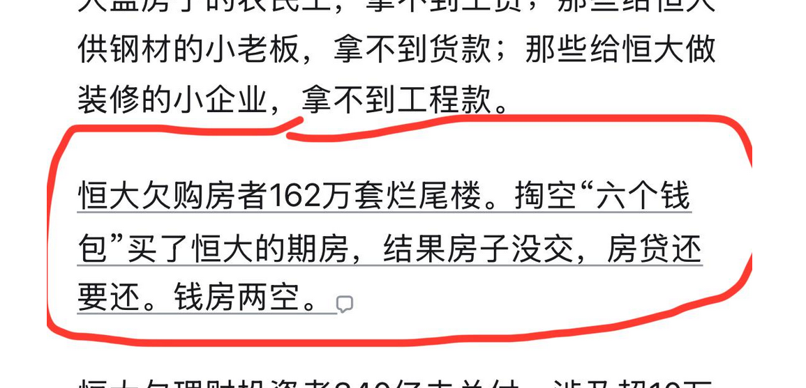
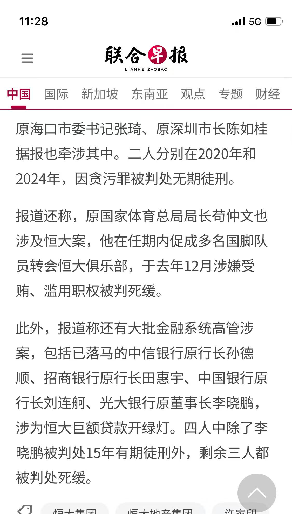

[[回到列表]](https://mzhan017.github.io/)
# [杂谈] 烂尾楼
最近皮带的事情很热闹，网上议论是沸沸腾腾。有人形象的比喻，2.4万的行头，皮带占400，不算过分吧？

烂尾楼业主面临的困境本质是“三重不公”：交易未完成却要承担债务、开发商违约却能破产脱身、个人破产通道对普通购房者紧闭。这种“慢性资金出血”不仅消耗家庭积蓄，更撕裂了社会信任，当六个钱包掏空换来的是钢筋水泥的框架，当每月按时还贷却住不进新房，负面情绪的积累绝非“不能有”就能化解，而是可能演变为对规则公平性的质疑。 
这种情绪的根源在于契约精神的双重标准。开发商可以通过破产程序将债务甩给银行和业主，而业主却被要求继续履行贷款合同，即便房子可能永远无法交付。2023年恒大集团负债2.4万亿、许家印前妻丁玉梅被曝转移427亿资产至海外的案例，更激化了这种矛盾：当开发商高管能通过离婚等手段转移资产，普通业主却连停止还贷的权利都没有，这种对比让“契约精神”显得格外讽刺。 
还有一部分人说：“买房亏了就想破产不认，买房赚了也没见谁把赚的钱分给银行啊”，这个人说的，逻辑上有些问题，这里根本就不是买房亏了，而是交易都没有完成，房子没有交到用户的手里，怎么就算亏了，这是地产商违约在先。契约精神哪里去了，你房地产商可以破产，我一个背负债务的烂尾房房主，找谁投诉去？难道不能破产？仍然要还贷款，去填地产商的窟窿？ 完全说不过去！ 

还有人说：

其实这就是银行玩不起了。咱们看看下面的新闻，就知道银行是怎么玩的了：
